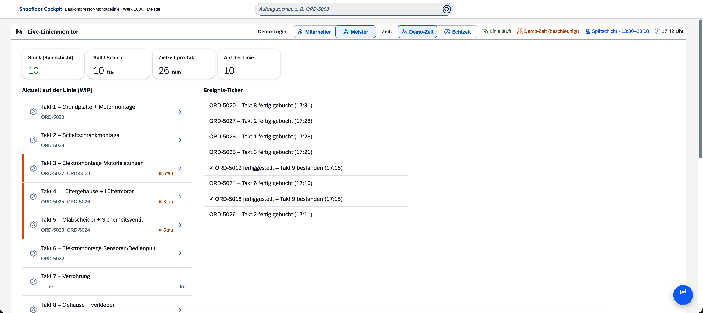
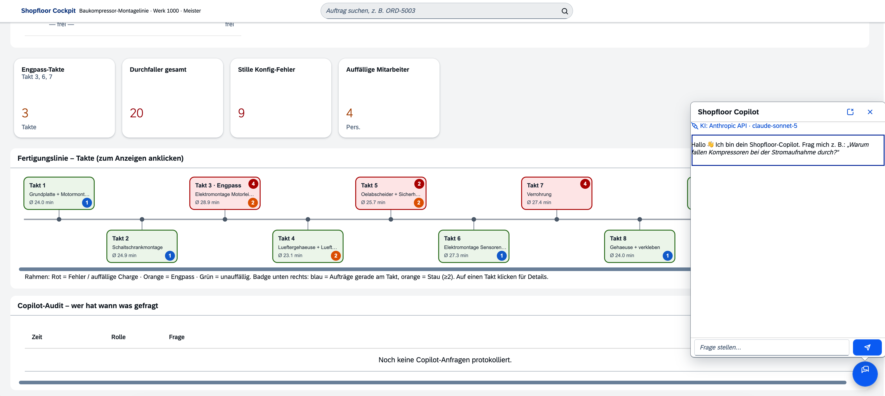

# Shopfloor-Copilot

**🇬🇧 [English version →](README.md)**

> KI-Assistenz-Schicht für SAP – ein Fertigungs-Copilot für eine Baukompressor-Montagelinie, gebaut als **Side-by-Side-Erweiterung** auf SAP BTP (CAP · Fiori · OData v4).

**🚀 Live-Demo: [sap-shopfloor-copilot.duckdns.org](https://sap-shopfloor-copilot.duckdns.org)** — login-frei, mit Rollen-Umschalter (Meister / Mitarbeiter), zweisprachig **DE/EN**. Der Copilot antwortet live über Claude (Sonnet), abgesichert durch ein Rate-Limit.

Der Shopfloor-Copilot beantwortet in natürlicher Sprache Fragen zu einer laufenden Montagelinie – Engpässe, Qualitätsprobleme, Wurzelursachen – und stützt jede Antwort auf **deterministische Analyse-Funktionen über echte Auftragsdaten** statt auf frei halluzinierten Text. Er ist bewusst als *realistische SAP-Erweiterung* gebaut: OData-Service, Fiori-UI, Rollen & Berechtigungen, Audit-Log und ein austauschbarer LLM-Layer.

**Stack:** SAP CAP 9 (Node 22) · OData v4 · SAPUI5 1.120 (Freestyle, `sap.m` + `sap.f`) · SQLite (lokal) / SAP HANA Cloud (BTP) · XSUAA · i18n DE/EN (UI **und** Backend-Texte) · Multi-Path-LLM (Ollama · Claude Agent SDK · Anthropic API)



---

## Der Use Case

Eine getaktete Montagelinie fertigt Baukompressoren: 8 Montagestationen, Inline-Prüfung, Prüfraum (Langzeitlauf), Versand. Zieltakt ~26 min, 16 Stück je Schicht. Drei Rückverfolgbarkeits-Stufen sind abgebildet – **serialisiert** (Sicherheitsventil), **chargengeführt** (Kabelbaum) und **Kanban** (Schüttgut, der blinde Fleck).

Das klassische MES sieht *dass* etwas durchfällt. Es sieht nicht *warum*. Genau da setzt der Copilot an – in zwei Modi:

- **Präventiv (Poka-Yoke):** Beim Einbau gleicht `validateInstall` das verbaute Teil gegen die Soll-Spezifikation des Auftrags ab und stoppt den Fehler am Scan – *bevor* er die Linie runterläuft.
- **Diagnostisch (Root-Cause):** Über alle Durchfaller hinweg findet der Copilot den geteilten Faktor – z. B. eine schlechte Kabelbaum-Charge, die als Phasenasymmetrie im Drehstrommotor auftaucht.

### Die eingebauten Fehlerszenarien

Vier realistische Fehler sind in die 80 Demo-Aufträge eingewoben – jeder mit eigenem Signal und eigener Nachweiskette:

| Station | Szenario | Signal | Erkennung |
|---|---|---|---|
| **St. 3** Elektromontage | schlechte Kabelbaum-Charge `KB-2024-883` | Phasenasymmetrie L1/L2/L3 | datengetrieben (Root-Cause) |
| **St. 5** Ölabscheider | falsches Ventil (8 statt 10 bar) | Druck/Konfig-Mismatch | Poka-Yoke am Scan |
| **St. 7** Verrohrung | Dichtgummi-Charge `DG-2024-417` | Dichtheitsprüfung | datengetrieben |
| **St. 7** Verrohrung | falsche Markt-Variante (US statt EU) | *stiller* Fehler – Prüfstand meldet nichts | Soll-Ist-Abgleich |

Der letzte ist der interessante: ein Fehler, den das alte System **nicht** meldet, weil physikalisch alles im grünen Bereich läuft – nur eben die falsche Anschlussvariante. Der Copilot findet ihn über den Soll-Ist-Vergleich der verbauten Teile.

---

## Architektur

```
┌──────────────────────────────────────────────────────────┐
│  Fiori / SAPUI5 Freestyle  (app/webapp)                   │
│  Live-Monitor · Timeline-Diagramm · KPIs · Copilot-Chat   │
└───────────────┬──────────────────────────────────────────┘
                │  OData v4  (/shopfloor)
┌───────────────▼──────────────────────────────────────────┐
│  SAP CAP Service  (srv/shopfloor-service.js)              │
│                                                           │
│   Deterministische Analyse-„Tools"                        │
│   bottleneck · failureSummary · rootCause ·               │
│   currentAsymmetry · configMismatches · stockLevels · …   │
│                                                           │
│   askCopilot(question)  ──►  Tool-Calling-Loop + RAG      │
└───────────────┬──────────────────────────────────────────┘
                │  runCopilot({ system, question, tools, impl })
┌───────────────▼──────────────────────────────────────────┐
│  LLM-Layer  (srv/lib/llm.js)  – ein Interface, 3 Pfade    │
│   ① Lokal / On-Prem  →  Ollama (qwen2.5)                  │
│   ② Abo             →  Claude Agent SDK (~/.claude)        │
│   ③ API             →  Anthropic API (claude-sonnet-5)     │
└───────────────┬──────────────────────────────────────────┘
                │
        SQLite (lokal)  /  SAP HANA Cloud (BTP)
```

**Kernidee:** Das LLM formuliert und orchestriert, aber es *rechnet nicht selbst*. Alle Kennzahlen – Engpass, Fehlerquote, Wurzelursache – kommen aus deterministischen CAP-Funktionen über die echte Datenbank. Das LLM ruft sie per Function-Calling auf und formuliert die Antwort. So bleibt die Analyse reproduzierbar und auditierbar, unabhängig vom gewählten Modell.



---

## Multi-Path-LLM: ein Interface, drei Pfade

Der ganze Reiz liegt in `runCopilot()` – dieselbe Tool-Liste und derselbe System-Prompt laufen über drei austauschbare Backends. Umschaltbar zur **Laufzeit** (im lokalen Copilot) oder per `.env`, ohne den Service-Code anzufassen.

| Pfad | Backend | Wann | Kosten |
|---|---|---|---|
| **① Lokal / On-Prem** | Ollama · `qwen2.5` (OpenAI-kompatibel, `localhost`) | Datensicherheit – Daten verlassen das Haus nie | 0 € |
| **② Abo** | Claude Agent SDK über Claude-Abo (`~/.claude`) | lokale Entwicklung mit Top-Qualität | 0 € (Abo) |
| **③ API** | Anthropic API · `claude-sonnet-5` | Cloud-/Public-Betrieb | Pay-per-Token |

Warum das architektonisch zählt:

- **On-Prem als Datenschutz-Argument.** Der lokale Pfad zeigt, dass sensible Fertigungsdaten *das Werk nie verlassen müssen* – ein reales Kaufkriterium im Industrieumfeld. Kleine Modelle (7B) rechnen Aggregationen unzuverlässig, deshalb sind die aggregierenden Tools (`bottleneck`, `failureSummary`, `workerQuality`) **vorverdaut**: das Tool liefert dem Modell das fertige Ergebnisfeld + einen Klartext-Hinweis statt roher Arrays. Damit nennt auch ein lokales 7B-Modell zuverlässig die richtige Station statt einer plausibel-falschen.
- **Cloud erzwingt den API-Pfad.** Läuft die App auf BTP (erkannt an `VCAP_APPLICATION`), wird hart auf den API-Pfad geschaltet und der Umschalter deaktiviert – der Abo-Pfad braucht lokale Credentials und darf nie remote laufen.
- **Kostenmodell.** `claude-sonnet-5` statt Opus für den Public-Pfad (~60 % günstiger bei near-Opus-Qualität), plus ein hartes **Rate-Limit** (per User / global / Tageslimit) als Kostenbremse gegen Missbrauch.

---

## Governance & Datenschutz

Die Erweiterung ist von Anfang an rollenbasiert gebaut – zwei Rollen, konsistent über OData, UI *und* Copilot:

| Rolle | Sieht |
|---|---|
| **Mitarbeiter** (`Worker`) | Live-Monitor, KPIs, Auftragszettel, Copilot mit **gefilterten Tools**; Mitarbeiter-Namen in Buchungen **maskiert** (nur Personalnummer) |
| **Meister** (`Supervisor`) | zusätzlich: Wurzelursachen, stille Konfig-Fehler, Klarnamen, Mitarbeiter-Qualitätskennzahlen, Audit-Log |

Drei Punkte, die über „Rollen im CDS" hinausgehen:

- **In-Process-Gating.** OData-`@requires` schützt nur direkte Endpunkt-Aufrufe – **nicht** die internen Tool-Calls des Copilots. Deshalb wird die Tool-Liste zusätzlich pro Rolle gefiltert (`WORKER_TOOLS` vs. `SUPERVISOR_TOOLS`). Ohne diesen Schritt wäre der Copilot ein Umgehungspfad an der Berechtigung vorbei.
- **Feld-Maskierung (DSGVO).** Mitarbeiter-Namen werden im **Backend** maskiert, nicht im Frontend – greift damit in UI und Copilot gleichermaßen. Qualitäts-/Leistungskennzahlen einzelner Mitarbeiter sieht nur der Meister.
- **Audit-Log.** Jeder Copilot-Aufruf wird protokolliert (wer, wann, welche Frage, welche Tools) – die Tabelle selbst ist Supervisor-only. Es wird nur die Antwortlänge gespeichert, kein Volltext.

Getestet mit einem **128-Fälle-Katalog** (43 Fragen × 2 LLM-Pfade × 2 Rollen), inkl. gezieltem Leak-Scan: 0 Governance-Leaks nach Härtung. Auch die Zweisprachigkeit ist governance-fest: Der Rollenfilter läuft über sprachunabhängige interne Schlüssel, nicht über übersetzte Labels.

---

## Zweisprachigkeit (DE/EN)

Die App ist durchgängig zweisprachig – umschaltbar per `DE|EN`-Schalter in der Live-Monitor-Toolbar:

- **UI** über UI5-ResourceBundles (`i18n_de` / `i18n_en`, je ~125 Keys).
- **Backend-Texte** (Stationsnamen, Schicht-Labels, Ereignis-Ticker, Fehlerkatalog, Analyse-Hypothesen) sprachabhängig über `Accept-Language` → CAP `req.locale`.
- **Copilot** antwortet in der UI-Sprache – bzw. in der Sprache der Frage, wenn sie erkennbar abweicht.

---

## Lokal starten

Voraussetzung: Node 22, `npm`. Läuft komplett lokal, in-memory (SQLite mit CSV-Seed), ohne Cloud-Account.

```bash
git clone https://github.com/TomSchoe/sap-shopfloor-copilot.git
cd sap-shopfloor-copilot
npm install
cds watch          # Port 4004, In-Memory-SQLite, HMR
```

- **App:** http://localhost:4004/webapp/index.html
- **OData-Service:** http://localhost:4004/shopfloor/
- **CAP-Index / $metadata:** http://localhost:4004/

### Test-Logins (lokal, mocked auth)

| User | Passwort | Rolle |
|---|---|---|
| `mitarbeiter` | `mitarbeiter` | Mitarbeiter |
| `meister` | `meister` | Meister (sieht alles) |

Ein Demo-Umschalter oben im Live-Monitor (nur auf `localhost` sichtbar) wechselt die Rolle. In Produktion übernimmt das XSUAA / SSO über Role Collections.

### Copilot-Pfad wählen (`.env`, optional)

Ohne Konfiguration läuft die App vollständig – nur der Copilot braucht einen LLM-Pfad. Alles ist env-gated:

```bash
# ① Lokal / On-Prem (gratis, Daten bleiben lokal) – Ollama muss laufen
LLM_PROVIDER=local
LLM_LOCAL_MODEL=qwen2.5

# ② Abo (gratis lokal) – setzt eine eingeloggte Claude-CLI voraus
CLAUDE_USE_SUBSCRIPTION=true

# ③ API (Pay-per-Token) – für Cloud-/Public-Betrieb
# ANTHROPIC_API_KEY=sk-ant-...
```

> Für den lokalen Pfad: `brew services start ollama && ollama pull qwen2.5`. Eine `.env`-Änderung braucht einen `cds watch`-Neustart; der Pfad-Wechsel *im* Copilot (Meister, lokal) geht ohne Neustart.

---

## SAP BTP Deployment

Die App ist deploy-fähig für SAP BTP vorbereitet (Multi-Target-Application) und läuft dort auf einem Trial-Account:

- **SAP HANA Cloud** als Persistenz (statt lokalem SQLite)
- **XSUAA** für Authentifizierung, Rollen über **Role Collections** (`Worker` / `Supervisor`)
- **Approuter** als Einstiegspunkt, beide Routen XSUAA-gated
- Copilot in der Cloud fix über den **API-Pfad** (Sonnet 5) mit aktivem Rate-Limit

```bash
mbt build                       # erzeugt mta_archives/shopfloor-copilot_1.0.0.mtar
cf deploy mta_archives/*.mtar   # benötigt CF-CLI + MultiApps-Plugin + BTP-Account
```

Der Copilot läuft auf BTP direkt über die Anthropic API – kein SAP AI Core / Gen AI Hub nötig (der Layer wäre über `srv/lib/llm.btp.js` anschließbar). Agent-SDK & zod sind reine devDependencies und landen nicht im Cloud-Bundle.

---

## Projektstruktur

```
db/
  schema.cds              Datenmodell (Aufträge, Teile, Prüfungen, Störungshistorie, Audit)
  data/*.csv              80 Demo-Aufträge mit 4 eingebauten Fehlerszenarien
srv/
  shopfloor-service.cds   OData-Service + Function-/Action-Definitionen
  shopfloor-service.js    Analyse-Tools, Live-Simulation, askCopilot-Handler, Governance, i18n
  lib/llm.js              Multi-Path-LLM (runCopilot) – die drei austauschbaren Pfade
app/
  webapp/                 Fiori Freestyle UI (index.html, Component, Main-View + -Controller, i18n)
  router/                 Approuter-Konfig für BTP (xs-app.json)
mta.yaml                  Multi-Target-Application-Deskriptor (BTP-Deployment)
xs-security.json          XSUAA-Rollendefinition (Worker / Supervisor)
```

---

## Reifegrad (ehrlich eingeordnet)

Dies ist ein **Portfolio- / Proof-of-Concept-Projekt**, kein produktives System:

- **Funktionale Demo:** rund, tief, konsistent – Live-Simulation, Copilot voll an alle Features angebunden, Governance getestet, zweisprachig.
- **Was fehlt für „echten Pilot":** Anbindung an ein reales S/4HANA (statt Demo-Daten), automatisierte Tests/Härtung über den Copilot-Katalog hinaus, HANA-Vektor-RAG statt Keyword-Retrieval.

Die Live-Linie ist eine **deterministische Simulation** (Funktion der Zeit, kein `Math.random`) – bewusst so getaggt und jederzeit gegen einen echten Confirmation-Feed austauschbar.

---

## Über dieses Projekt

Gebaut als Referenz-Implementierung einer KI-Erweiterung auf dem SAP-Stack – mit Fokus auf die Punkte, die ein solches Projekt in der Praxis tragen oder scheitern lassen: **saubere Trennung von deterministischer Analyse und LLM-Orchestrierung**, **durchgehende Governance** (auch am Copilot vorbei), und ein **austauschbarer LLM-Layer**, der von On-Prem-Datenschutz bis Cloud-Betrieb skaliert.

## Lizenz

Dieses Repository ist zu Demonstrations- und Portfolio-Zwecken veröffentlicht (**view-only**). Alle Rechte vorbehalten – Nutzung, Kopie, Veränderung oder Weiterverwendung des Codes nur mit ausdrücklicher schriftlicher Genehmigung. Details: [LICENSE](LICENSE).
