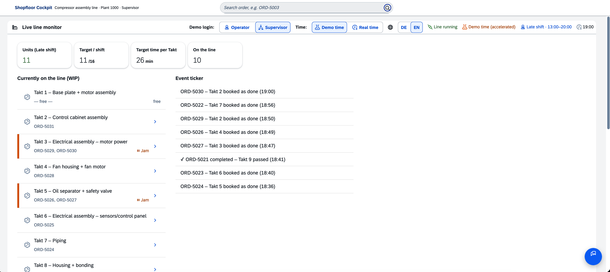
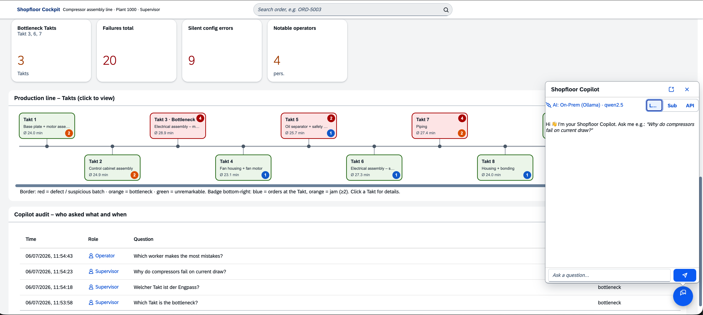

# Shopfloor Copilot

**🇩🇪 [Deutsche Version →](README.de.md)**

> An AI assistance layer for SAP – a manufacturing copilot for a construction-compressor assembly line, built as a **side-by-side extension** on SAP BTP (CAP · Fiori · OData v4).

**🚀 Live demo: [sap-shopfloor-copilot.duckdns.org](https://sap-shopfloor-copilot.duckdns.org)** — no login required, with a role switcher (supervisor / operator), fully bilingual **DE/EN**. The copilot answers live via Claude (Sonnet), protected by a rate limit.

The Shopfloor Copilot answers natural-language questions about a running assembly line – bottlenecks, quality issues, root causes – and grounds every answer in **deterministic analysis functions over real order data** instead of freely hallucinated text. It is deliberately built as a *realistic SAP extension*: OData service, Fiori UI, roles & authorizations, audit log, and a swappable LLM layer.

**Stack:** SAP CAP 9 (Node 22) · OData v4 · SAPUI5 1.120 (freestyle, `sap.m` + `sap.f`) · SQLite (local) / SAP HANA Cloud (BTP) · XSUAA · i18n DE/EN (UI **and** backend texts) · multi-path LLM (Ollama · Claude Agent SDK · Anthropic API)



---

## The use case

A takt-paced assembly line builds construction compressors: 8 assembly stations, inline testing, test room (long-run test), shipping. Target takt ~26 min, 16 units per shift. Three levels of traceability are modeled – **serialized** (safety valve), **batch-tracked** (wiring harness), and **kanban** (bulk material, the blind spot).

A classic MES sees *that* something fails. It does not see *why*. That is exactly where the copilot comes in – in two modes:

- **Preventive (poka-yoke):** At installation time, `validateInstall` checks the installed part against the order's target specification and stops the defect right at the scan – *before* it travels down the line.
- **Diagnostic (root cause):** Across all failed units, the copilot finds the shared factor – e.g. a bad wiring-harness batch that shows up as phase asymmetry in the three-phase motor.

### The built-in defect scenarios

Four realistic defects are woven into the 80 demo orders – each with its own signal and its own chain of evidence:

| Station | Scenario | Signal | Detection |
|---|---|---|---|
| **St. 3** Electrical assembly | bad wiring-harness batch `KB-2024-883` | phase asymmetry L1/L2/L3 | data-driven (root cause) |
| **St. 5** Oil separator | wrong valve (8 instead of 10 bar) | pressure/config mismatch | poka-yoke at the scan |
| **St. 7** Piping | sealing-rubber batch `DG-2024-417` | leak test | data-driven |
| **St. 7** Piping | wrong market variant (US instead of EU) | *silent* defect – the test bench reports nothing | target/actual comparison |

The last one is the interesting one: a defect the legacy system does **not** report because physically everything is within limits – it is simply the wrong connection variant. The copilot finds it via the target/actual comparison of the installed parts.

---

## Architecture

```
┌──────────────────────────────────────────────────────────┐
│  Fiori / SAPUI5 freestyle  (app/webapp)                   │
│  Live monitor · timeline diagram · KPIs · copilot chat    │
└───────────────┬──────────────────────────────────────────┘
                │  OData v4  (/shopfloor)
┌───────────────▼──────────────────────────────────────────┐
│  SAP CAP service  (srv/shopfloor-service.js)              │
│                                                           │
│   Deterministic analysis "tools"                          │
│   bottleneck · failureSummary · rootCause ·               │
│   currentAsymmetry · configMismatches · stockLevels · …   │
│                                                           │
│   askCopilot(question)  ──►  tool-calling loop + RAG      │
└───────────────┬──────────────────────────────────────────┘
                │  runCopilot({ system, question, tools, impl })
┌───────────────▼──────────────────────────────────────────┐
│  LLM layer  (srv/lib/llm.js)  – one interface, 3 paths    │
│   ① Local / on-prem  →  Ollama (qwen2.5)                  │
│   ② Subscription    →  Claude Agent SDK (~/.claude)        │
│   ③ API             →  Anthropic API (claude-sonnet-5)     │
└───────────────┬──────────────────────────────────────────┘
                │
        SQLite (local)  /  SAP HANA Cloud (BTP)
```

**Core idea:** The LLM phrases and orchestrates, but it *never does the math itself*. Every figure – bottleneck, failure rate, root cause – comes from deterministic CAP functions over the real database. The LLM calls them via function calling and phrases the answer. That keeps the analysis reproducible and auditable, regardless of the chosen model.



---

## Multi-path LLM: one interface, three paths

The whole appeal sits in `runCopilot()` – the same tool list and the same system prompt run against three swappable backends. Switchable at **runtime** (in the local copilot) or via `.env`, without touching the service code.

| Path | Backend | When | Cost |
|---|---|---|---|
| **① Local / on-prem** | Ollama · `qwen2.5` (OpenAI-compatible, `localhost`) | data security – data never leaves the premises | €0 |
| **② Subscription** | Claude Agent SDK via Claude subscription (`~/.claude`) | local development with top quality | €0 (subscription) |
| **③ API** | Anthropic API · `claude-sonnet-5` | cloud / public operation | pay per token |

Why this matters architecturally:

- **On-prem as the data-privacy argument.** The local path demonstrates that sensitive manufacturing data *never has to leave the plant* – a real buying criterion in industrial settings. Small models (7B) are unreliable at aggregations, so the aggregating tools (`bottleneck`, `failureSummary`, `workerQuality`) are **pre-digested**: the tool hands the model a ready-made result field plus a plain-text hint instead of raw arrays. That way even a local 7B model reliably names the right station instead of a plausible-but-wrong one.
- **The cloud enforces the API path.** When the app runs on BTP (detected via `VCAP_APPLICATION`), it is hard-switched to the API path and the switcher is disabled – the subscription path needs local credentials and must never run remotely.
- **Cost model.** `claude-sonnet-5` instead of Opus for the public path (~60% cheaper at near-Opus quality), plus a hard **rate limit** (per user / global / daily cap) as a cost brake against abuse.

---

## Governance & data privacy

The extension is role-based from the ground up – two roles, consistent across OData, UI *and* copilot:

| Role | Sees |
|---|---|
| **Operator** (`Worker`) | live monitor, KPIs, order sheet, copilot with **filtered tools**; worker names in bookings **masked** (personnel number only) |
| **Supervisor** | additionally: root causes, silent config defects, real names, per-worker quality figures, audit log |

Three points that go beyond "roles in CDS":

- **In-process gating.** OData `@requires` only protects direct endpoint calls – **not** the copilot's internal tool calls. The tool list is therefore additionally filtered per role (`WORKER_TOOLS` vs. `SUPERVISOR_TOOLS`). Without this step the copilot would be a bypass around the authorization model.
- **Field masking (GDPR).** Worker names are masked in the **backend**, not the frontend – so it applies to UI and copilot alike. Per-worker quality/performance figures are supervisor-only.
- **Audit log.** Every copilot call is logged (who, when, which question, which tools) – the table itself is supervisor-only. Only the answer length is stored, never the full text.

Tested with a **128-case catalog** (43 questions × 2 LLM paths × 2 roles), including a targeted leak scan: 0 governance leaks after hardening. The bilingual layer is governance-safe too: the role filter operates on language-independent internal keys, not on translated labels.

---

## Bilingual by design (DE/EN)

The app is bilingual end to end – switchable via the `DE|EN` toggle in the live-monitor toolbar:

- **UI** via UI5 resource bundles (`i18n_de` / `i18n_en`, ~125 keys each).
- **Backend texts** (station names, shift labels, event ticker, defect catalog, analysis hypotheses) are language-aware via `Accept-Language` → CAP `req.locale`.
- **The copilot** answers in the UI language – or in the language of the question if it clearly differs.

---

## Run it locally

Prerequisites: Node 22, `npm`. Runs fully local, in-memory (SQLite with CSV seed), no cloud account needed.

```bash
git clone https://github.com/TomSchoe/sap-shopfloor-copilot.git
cd sap-shopfloor-copilot
npm install
cds watch          # port 4004, in-memory SQLite, HMR
```

- **App:** http://localhost:4004/webapp/index.html
- **OData service:** http://localhost:4004/shopfloor/
- **CAP index / $metadata:** http://localhost:4004/

### Test logins (local, mocked auth)

| User | Password | Role |
|---|---|---|
| `mitarbeiter` | `mitarbeiter` | operator |
| `meister` | `meister` | supervisor (sees everything) |

A demo switcher at the top of the live monitor (visible on `localhost` only) changes the role. In production, XSUAA / SSO takes over via role collections.

### Choose the copilot path (`.env`, optional)

The app runs completely without configuration – only the copilot needs an LLM path. Everything is env-gated:

```bash
# ① Local / on-prem (free, data stays local) – requires a running Ollama
LLM_PROVIDER=local
LLM_LOCAL_MODEL=qwen2.5

# ② Subscription (free locally) – requires a logged-in Claude CLI
CLAUDE_USE_SUBSCRIPTION=true

# ③ API (pay per token) – for cloud / public operation
# ANTHROPIC_API_KEY=sk-ant-...
```

> For the local path: `brew services start ollama && ollama pull qwen2.5`. Changing `.env` requires a `cds watch` restart; switching the path *inside* the copilot (supervisor, local) works without a restart.

---

## SAP BTP deployment

The app is prepared for SAP BTP deployment (multi-target application) and runs there on a trial account:

- **SAP HANA Cloud** as persistence (instead of local SQLite)
- **XSUAA** for authentication, roles via **role collections** (`Worker` / `Supervisor`)
- **Approuter** as the entry point, both routes XSUAA-gated
- In the cloud, the copilot is fixed to the **API path** (Sonnet 5) with the rate limit active

```bash
mbt build                       # produces mta_archives/shopfloor-copilot_1.0.0.mtar
cf deploy mta_archives/*.mtar   # requires CF CLI + MultiApps plugin + BTP account
```

On BTP the copilot talks to the Anthropic API directly – no SAP AI Core / Gen AI Hub required (that layer could be attached via `srv/lib/llm.btp.js`). The Agent SDK & zod are pure devDependencies and never end up in the cloud bundle.

---

## Project structure

```
db/
  schema.cds              data model (orders, parts, tests, issue history, audit)
  data/*.csv              80 demo orders with 4 built-in defect scenarios
srv/
  shopfloor-service.cds   OData service + function/action definitions
  shopfloor-service.js    analysis tools, live simulation, askCopilot handler, governance, i18n
  lib/llm.js              multi-path LLM (runCopilot) – the three swappable paths
app/
  webapp/                 Fiori freestyle UI (index.html, Component, main view + controller, i18n)
  router/                 approuter config for BTP (xs-app.json)
mta.yaml                  multi-target application descriptor (BTP deployment)
xs-security.json          XSUAA role definition (Worker / Supervisor)
```

---

## Maturity (an honest assessment)

This is a **portfolio / proof-of-concept project**, not a production system:

- **Functional demo:** polished, deep, consistent – live simulation, copilot fully wired into every feature, governance tested, bilingual.
- **What a "real pilot" would still need:** connection to a real S/4HANA (instead of demo data), automated tests/hardening beyond the copilot catalog, HANA vector RAG instead of keyword retrieval.

The live line is a **deterministic simulation** (a pure function of time, no `Math.random`) – deliberately tagged as such and swappable for a real confirmation feed at any time.

---

## About this project

Built as a reference implementation of an AI extension on the SAP stack – focused on the points that make or break such a project in practice: **clean separation of deterministic analysis and LLM orchestration**, **end-to-end governance** (including around the copilot), and a **swappable LLM layer** that scales from on-prem data privacy to cloud operation.

## License

This repository is published for demonstration and portfolio purposes (**view-only**). All rights reserved – using, copying, modifying, or redistributing the code requires prior written permission. Details: [LICENSE](LICENSE).
